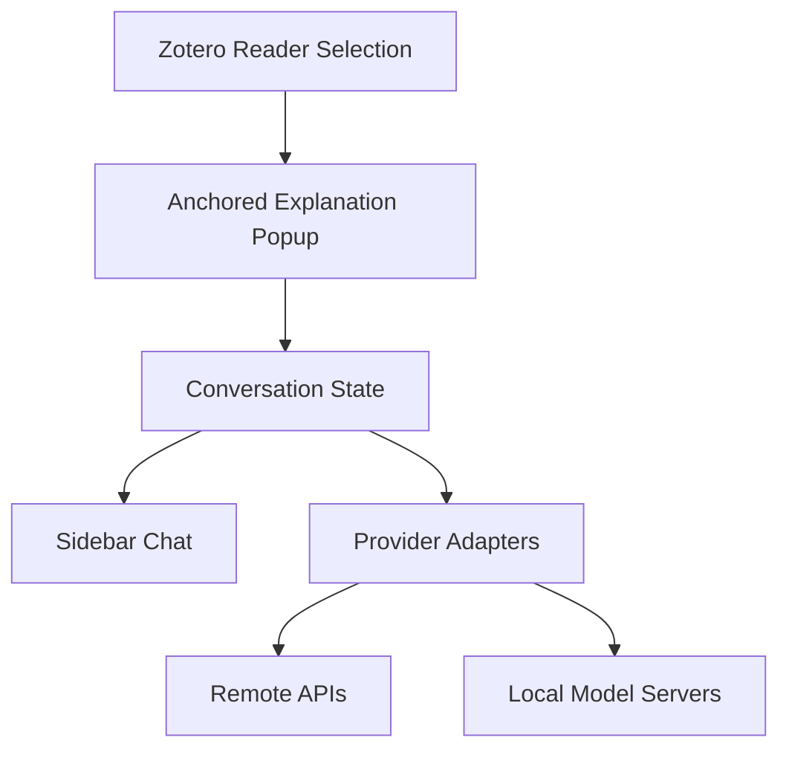

# Zotero AI Explain

Zotero AI Explain is a Zotero plugin project for selected-text explanations, anchored popup
responses, and sidebar follow-up chat with configurable model providers.

## Status

This repository is in active greenfield implementation. The current target is Zotero 8, with
selected-text explanations, anchored popup responses, sidebar follow-up chat, and configurable
remote or local model providers.

## Development

```bash
npm install
pre-commit install
npm run build
npm run verify
pre-commit run --all-files
```

The build emits the Zotero bootstrap bundle at `addon/content/zotero-ai-explain.sys.mjs`.

## Zotero 8 Manual Verification

Use `docs/manual-verification/zotero-8.md` for the manual acceptance pass after building and
packaging the `addon/` directory. The plugin manifest requires Zotero `8.0` or newer.

## Architecture



## Project Layout

| Path       | Purpose                                                      |
| ---------- | ------------------------------------------------------------ |
| `src/`     | TypeScript source for plugin logic.                          |
| `tests/`   | Vitest test suite.                                           |
| `addon/`   | Zotero extension assets and browser-facing files.            |
| `docs/`    | Design specs, implementation plans, and human documentation. |
| `scripts/` | Build and packaging automation.                              |
| `.forge/`  | Forge phase state and learnings.                             |
