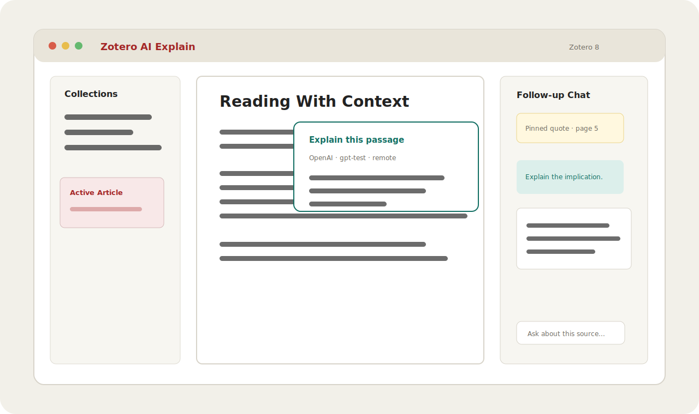
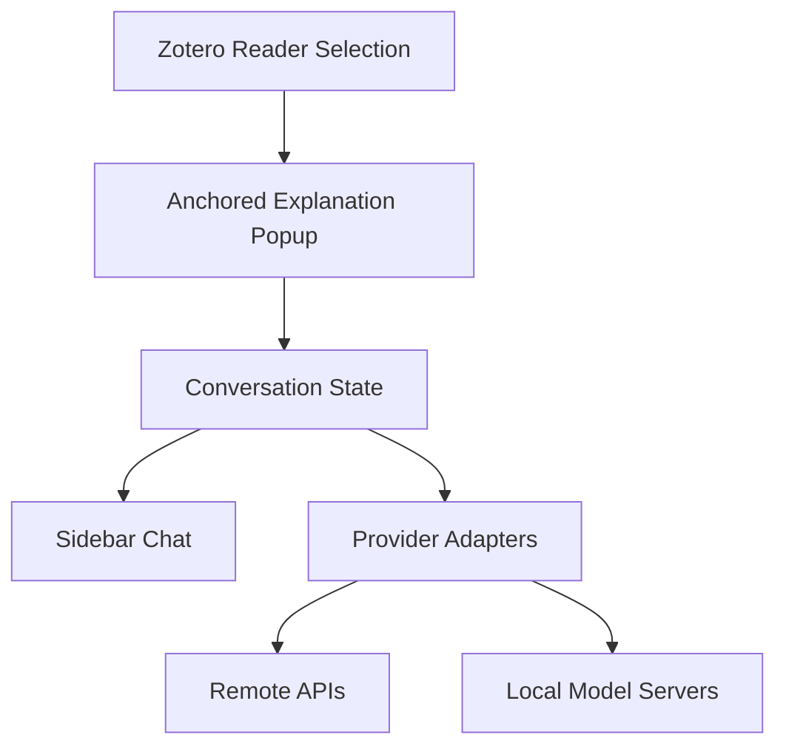

# Zotero AI Explain


Zotero AI Explain is a Zotero plugin for explaining selected text in-place. Select a passage in the
Zotero reader, ask for an explanation, review the answer in an anchored popup above the text, then
move the conversation into a sidebar when you want to keep chatting.



## Extension Preview



## Status

This repository is in active greenfield implementation. The core architecture, provider boundary,
conversation store, Zotero bootstrap, and initial reader UI surfaces are being built with tests.

## Features

- Anchored explanation popup for selected Zotero reader text.
- Sidebar conversation handoff for follow-up questions.
- Provider profiles for OpenAI Responses, OpenAI-compatible APIs, Anthropic, Gemini, custom HTTP,
  and local agent bridges.
- Secret references instead of storing raw API keys in plugin preferences.
- Zotero bootstrap bundle, with manual verification notes for reader integration.

## Development

```bash
npm install
pre-commit install
npm run build
npm run verify
pre-commit run --all-files
```

The build emits the Zotero bootstrap bundle at `addon/content/zotero-ai-explain.js` as an IIFE that
exposes `ZoteroAiExplain.startup` / `ZoteroAiExplain.shutdown`. The bundle is loaded into the
plugin's bootstrap scope via `Services.scriptloader.loadSubScript`; Firefox 140 ESR refuses
`ChromeUtils.importESModule` for non-trusted-scheme URLs, so the IIFE form is required.

## Manual Verification

Use `docs/manual-verification/zotero.md` for the manual acceptance pass after building and packaging
the `addon/` directory.

### Test With Ollama

```bash
ollama serve
ollama pull gemma4:e4b
ollama pull embeddinggemma
npm run build
node scripts/package-xpi.mjs v0.1.0
```

Install `zotero-ai-explain.xpi` in Zotero, open the plugin settings, and keep local-only mode
enabled for the first smoke test.

## Architecture



## Project Layout

| Path       | Purpose                                                                   |
| ---------- | ------------------------------------------------------------------------- |
| `src/`     | TypeScript source for plugin logic.                                       |
| `tests/`   | Vitest test suite.                                                        |
| `addon/`   | Zotero extension assets and browser-facing files.                         |
| `docs/`    | Design specs, implementation plans, and human documentation.              |
| `scripts/` | Build and packaging automation.                                           |
| `.forge/`  | Local Forge state is ignored; `.forge/learnings.jsonl` remains trackable. |
