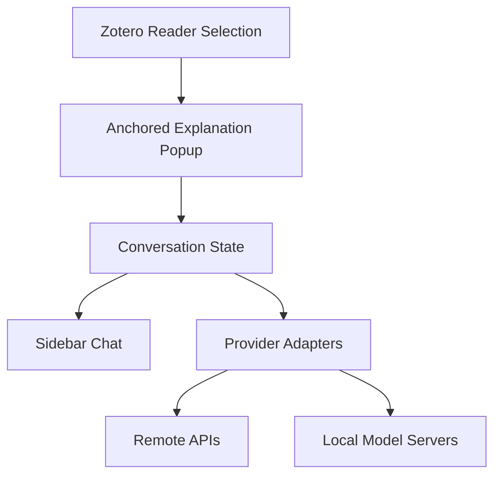

# Zotero AI Explain

Zotero AI Explain is a Zotero plugin project for selected-text explanations, anchored popup
responses, and sidebar follow-up chat with configurable model providers.

## Status

This repository is in greenfield setup. Product behavior will be specified in
`docs/superpowers/specs/` before implementation begins.

## Development

```bash
npm install
pre-commit install
npm run verify
pre-commit run --all-files
```

## Architecture



## Project Layout

| Path       | Purpose                                                      |
| ---------- | ------------------------------------------------------------ |
| `src/`     | TypeScript source for plugin logic.                          |
| `tests/`   | Vitest test suite.                                           |
| `addon/`   | Zotero extension assets and browser-facing files.            |
| `docs/`    | Design specs, implementation plans, and human documentation. |
| `scripts/` | Build and packaging automation.                              |
| `.forge/`  | Forge phase state and learnings.                             |
