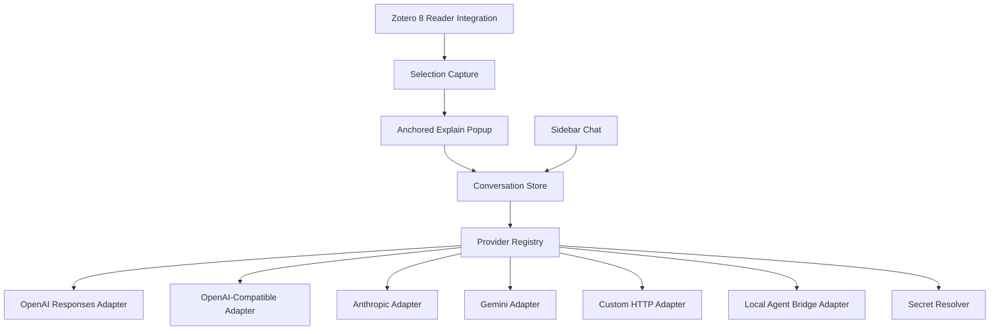

# Zotero AI Explain Design

created:: 2026-05-12 status:: approved-for-planning

## Summary

Build a Zotero 8-only plugin that lets a user select text in the Zotero reader, ask for an AI
explanation in an anchored popup near the selected text, and move that conversation into a sidebar
for follow-up chat. The plugin supports a broad provider ecosystem through one internal
model-provider contract, including remote APIs, OpenAI-compatible local servers, and explicitly
configured local agent bridges.

## Goals

- Target the latest Zotero major line: Zotero 8.
- Provide a low-friction selected-text explanation workflow in the Zotero reader.
- Preserve context when moving from anchored popup to sidebar chat.
- Support many model providers without coupling UI code to provider-specific APIs.
- Make local/private model use straightforward.
- Store secrets with a safer default while still supporting convenient setup.
- Avoid sending document text unless the user explicitly invokes an AI action.

## Non-Goals

- Zotero 7 compatibility.
- Browser-based companion UI outside Zotero.
- Cloud conversation sync.
- Automatic background document analysis without user action.
- Full agentic document editing in the first implementation.

## References

- Zotero 8 developer notes: <https://www.zotero.org/support/dev/zotero_8_for_developers>
- Zotero plugin development overview:
  <https://www.zotero.org/support/dev/client_coding/plugin_development>
- Zotero 7 developer notes that remain partly relevant for preferences:
  <https://www.zotero.org/support/dev/zotero_7_for_developers>

## Zotero 8 Platform Assumptions

Zotero 8 includes a Mozilla platform upgrade from the Firefox 115 era to Firefox 140. The
implementation should assume Zotero 8 conventions and avoid legacy compatibility paths. In practice,
this means:

- Use ESM-style modules for plugin source and internal modules.
- Avoid `.jsm` patterns and global imports.
- Use standard JavaScript promises rather than Bluebird-era APIs.
- Register Zotero UI integration through supported Zotero 8 APIs where available.
- Treat Zotero internals as unstable unless covered by current Zotero developer guidance or proven
  by integration tests.

The plugin manifest should declare Zotero 8 as the minimum supported line before release. The exact
`strict_min_version` should be verified against the installed Zotero 8 release during implementation
packaging.

## User Experience

### Selected-Text Explain Flow

1. User selects text in a PDF/EPUB reader tab.
2. The plugin detects a non-empty text selection and offers an `Explain` action.
3. User clicks `Explain`.
4. The plugin opens an anchored popup above or near the selection.
5. The popup streams a concise explanation using the active provider profile.
6. The popup shows provider/model identity, cancel/retry controls, and a `Continue in Sidebar`
   control.
7. If the user continues in the sidebar, the same conversation appears there with the selected quote
   and source metadata preserved.

### Sidebar Follow-Up Flow

The sidebar is the persistent chat surface. It should support:

- Multi-turn follow-up questions.
- The original selected quote as pinned context.
- Source metadata, including Zotero item identity and page/location when available.
- Provider/model selection per conversation or per request.
- Retry after provider failures.
- Cancellation of active streaming requests.
- Clear indication when a remote provider will receive selected text.

### Preferences Flow

The preferences UI should let users manage provider profiles:

- Provider type.
- Display name.
- Base URL where applicable.
- Model name.
- Optional endpoint-specific parameters.
- Secret source.
- Default provider/model for `Explain`.

## Architecture



### Components

| Component          | Responsibility                                                                                   |
| ------------------ | ------------------------------------------------------------------------------------------------ |
| Reader Integration | Detect reader lifecycle, text selections, and source metadata.                                   |
| Selection Capture  | Normalize selected text and location data into a stable context object.                          |
| Anchored Popup     | Render streamed explanation near the selection and expose handoff controls.                      |
| Sidebar Chat       | Persistently render conversation history and follow-up input.                                    |
| Conversation Store | Maintain local conversation state, messages, selected quote, and request status.                 |
| Provider Registry  | Resolve active provider profile into a concrete adapter.                                         |
| Provider Adapters  | Convert internal requests into provider-specific API calls and streaming events.                 |
| Secret Resolver    | Resolve API credentials from secure storage, environment references, or local config references. |
| Preferences UI     | Manage provider profiles and safe defaults.                                                      |

## Provider System

All providers implement one internal streaming contract:

```ts
type ModelProvider = {
  readonly id: string;
  readonly displayName: string;
  streamChat(request: ChatRequest, signal: AbortSignal): AsyncIterable<ChatEvent>;
};
```

The first implementation should include these adapter families:

- **OpenAI native:** Use the Responses API for current OpenAI models and streaming behavior.
- **OpenAI-compatible:** Support `/v1/chat/completions` style endpoints used by Ollama, LM Studio,
  vLLM, OpenRouter, Together, DeepSeek-compatible providers, and similar services.
- **Anthropic native:** Support Anthropic's Messages-style API.
- **Gemini native:** Support Gemini's native generate-content/streaming API.
- **Custom HTTP:** Advanced adapter profile where a user can configure endpoint, headers, request
  mapping, and response streaming mode within constrained safe templates.
- **Local agent bridge:** Experimental adapter for explicitly configured local Codex/Claude
  Code-style bridge servers. This is opt-in and disabled by default.

Provider adapters must normalize output into common events:

- `message_start`
- `delta`
- `message_end`
- `usage`
- `error`

## Secret Storage

Use a hybrid policy that prioritizes safety and keeps setup practical:

- Store non-secret provider profile data in Zotero preferences.
- Store API keys and tokens in Zotero/Firefox credential storage when available.
- Allow environment-variable references such as `OPENAI_API_KEY` for users who do not want secrets
  stored by the plugin.
- Allow local config-file references for advanced local workflows, but never log resolved secret
  values.
- Redact secrets from UI errors, debug logs, tests, and serialized state.

If secure credential storage is unavailable, the plugin should warn the user before storing a secret
in less-protected profile storage and offer environment variable references instead.

## Privacy And Safety

- No selected text leaves the machine until the user clicks an AI action.
- Before sending a request to a remote provider, the UI identifies the active provider/model.
- Local provider profiles should be easy to create and select.
- Conversations are local-only by default.
- Logs must not include selected document text unless the user enables an explicit debug mode, and
  even then secrets remain redacted.
- Provider failures should show actionable messages without exposing credentials or full request
  payloads.

## Error Handling

The UI should handle:

- Empty or unsupported selections.
- Selection metadata unavailable from Zotero internals.
- Provider not configured.
- Missing secret.
- Invalid model name.
- Network failure.
- Provider rate limit or quota failure.
- Streaming interruption.
- User cancellation.
- Sidebar handoff after popup request failure.

Failures should keep the selected quote available so the user can retry with a different provider.

## Testing Strategy

Tests should use public interfaces and treat implementation internals as black boxes. The
implementation plan should include adversarial tests for:

- Selection normalization from representative reader inputs.
- Popup state transitions: idle, streaming, cancelled, failed, completed.
- Sidebar handoff preserving quote, source metadata, provider, and messages.
- Provider registry resolution and unsupported provider handling.
- Streaming normalization for each adapter family.
- Secret redaction in errors and logs.
- Remote-provider privacy prompts.
- Zotero 8 startup/bootstrap registration behavior.

Manual integration testing will be required inside Zotero 8 because reader DOM integration depends
on Zotero internals.

## Acceptance Criteria

- AC-1: The plugin targets Zotero 8 only and avoids Zotero 7 compatibility code.
- AC-2: A user can select reader text and trigger an anchored explanation popup.
- AC-3: The popup streams an explanation and supports cancel/retry.
- AC-4: The conversation can move from popup to sidebar without losing selected quote, source
  metadata, provider, or prior messages.
- AC-5: The sidebar supports follow-up chat against the same conversation.
- AC-6: Provider profiles support OpenAI native, OpenAI-compatible, Anthropic, Gemini, custom HTTP,
  and opt-in local agent bridge adapters.
- AC-7: Secrets are resolved through secure storage or explicit external references and are redacted
  from logs/errors.
- AC-8: Remote-provider requests clearly identify the provider/model before selected text is sent.
- AC-9: Local providers can be configured without requiring a cloud account.
- AC-10: Provider failure, missing configuration, cancellation, and retry paths are handled without
  losing conversation context.
- AC-11: Automated tests cover provider registry behavior, conversation handoff, streaming state
  transitions, and secret redaction.
- AC-12: Zotero 8 manual verification covers plugin startup, reader selection, popup rendering, and
  sidebar chat.

## Open Questions For Planning

- Which exact Zotero 8 release should be used as the first manual test target?
- Which Zotero reader APIs are stable enough for selection anchoring, and which require defensive
  integration tests?
- Should the first package include all provider adapters enabled in UI, or should less common
  adapters remain hidden behind an advanced setting until tested?
- What local bridge protocol should be used for Codex/Claude Code-style servers: OpenAI-compatible
  HTTP, MCP, or a plugin-specific bridge contract?

## Spec Self-Review

- Placeholder scan: no TODO/TBD placeholders remain.
- Internal consistency: Zotero 8-only scope is repeated in goals, non-goals, platform assumptions,
  and AC-1.
- Scope check: broad provider support is large but still implementable as one feature because all
  provider work is bounded by one internal streaming contract.
- Ambiguity check: "safer and convenient" is resolved as hybrid secret storage: secure credential
  storage by default, external references allowed, less-secure profile storage only with warning.
- Risk check: Zotero reader integration and local agent bridges are the riskiest areas and are
  explicitly called out for manual/integration verification.
